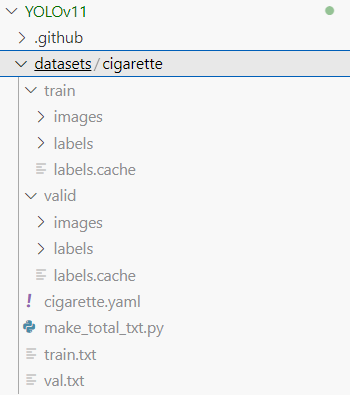
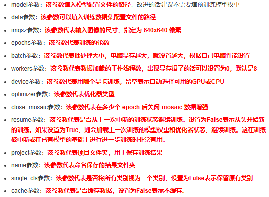
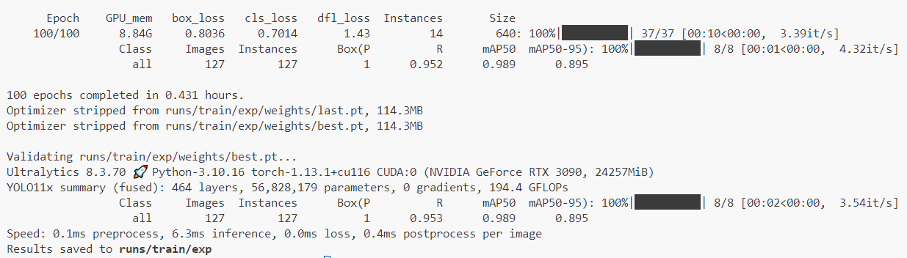
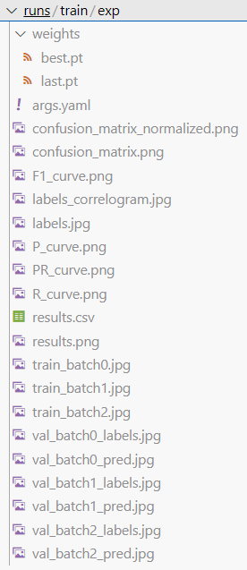
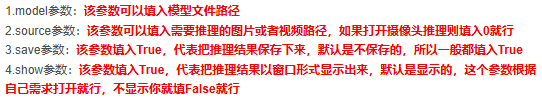
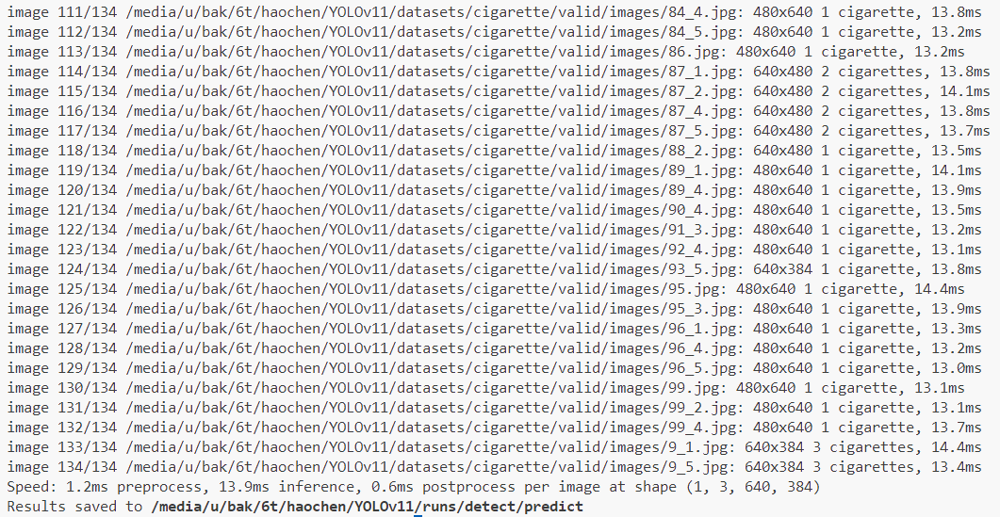
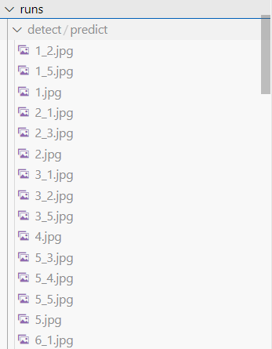
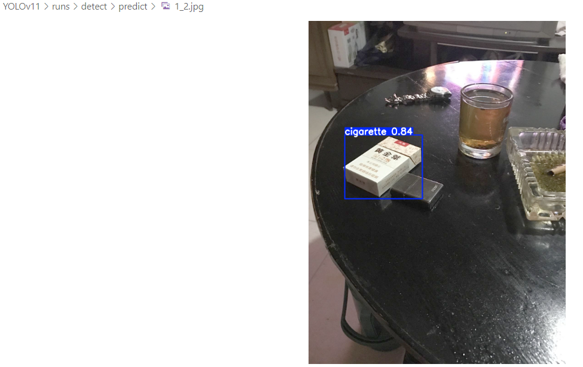

# YOLOv11目标检测开发文档

## 1、环境配置

按照以下方式配置环境：

```shell
conda create -p /media/u/bak/6t/haochen/envs/yolov11 python=3.10 -y
conda activate /media/u/bak/6t/haochen/envs/yolov11

pip install torch==1.13.1+cu116 torchvision==0.14.1+cu116 torchaudio==0.13.1 --extra-index-url https://download.pytorch.org/whl/cu116

pip install -r requirements.txt
```

## 2、数据集准备

可以参考`./datasets/cigarette`的数据集格式准备。

路径如下图所示：



## 3、训练过程

在终端输入：`python train.py` 即可。

`train.py` 内容如下：

```python
import warnings
warnings.filterwarnings('ignore')
from ultralytics import YOLO
 
if __name__ == '__main__':
    model = YOLO('yolo11x.yaml')
    # 如何切换模型版本, 上面的ymal文件可以改为 yolov11s.yaml就是使用的v11s,
    # 类似某个改进的yaml文件名称为yolov11-XXX.yaml那么如果想使用其它版本就把上面的名称改为yolov11l-XXX.yaml即可（改的是上面YOLO中间的名字不是配置文件的）！
    # model.load('yolov11n.pt') # 是否加载预训练权重,科研不建议大家加载否则很难提升精度
    model.train(data="/media/u/bak/6t/haochen/YOLOv11/datasets/cigarette/cigarette.yaml",
                # 如果大家任务是其它的'ultralytics/cfg/default.yaml'找到这里修改task可以改成detect, segment, classify, pose
                cache=False,
                imgsz=640,
                epochs=100,
                single_cls=False,  # 是否是单类别检测
                batch=8,
                close_mosaic=0,
                workers=0,
                device='0',
                optimizer='SGD', # using SGD 优化器 默认为auto建议大家使用固定的.
                # resume=, # 续训的话这里填写True, yaml文件的地方改为lats.pt的地址,需要注意的是如果你设置训练200轮次模型训练了200轮次是没有办法进行续训的.
                amp=True,  # 如果出现训练损失为Nan可以关闭amp
                project='runs/train',
                name='exp',
                resume=False
                )
```

参数解读如下：



训练结束后，界面显示如下：



在文件夹中有以下文件信息：



如果想要断点训练，则修改以下参数即可：

```python
model.load('xxx.pt')
resume=True
```

## 4、推理过程

在终端输入：`python detect.py` 即可。

`detect.py` 内容如下：

```python
from ultralytics import YOLO

if __name__ == '__main__':

    # Load a model
    model = YOLO(model='/media/u/bak/6t/haochen/YOLOv11/runs/train/exp/weights/best.pt')  
    model.predict(source='/media/u/bak/6t/haochen/YOLOv11/datasets/cigarette/valid/images',
                  save=True,
                  show=True,
                  )
```

参数解读如下：



推理结束后，界面显示如下：



在文件夹中有以下文件信息：



检测结果显示如下：

